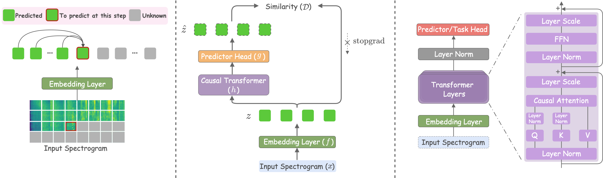

<div align="center">

# Listening Forward: Next Patch Embedding Prediction Enables Scalable Audio Learners

Umberto Cappellazzo<sup>1,2</sup>, Xubo Liu<sup>3</sup>, Stavros Petridis<sup>1,2</sup>, Maja Pantic<sup>1,2</sup>

<sup>1</sup> Imperial College London &nbsp;&nbsp; <sup>2</sup> NatWest AI Research &nbsp;&nbsp; <sup>3</sup> University of Surrey

[](https://arxiv.org/abs/XXXX.XXXXX)
[](https://huggingface.co/collections/??)
[](https://umbertocappellazzo.github.io/nape)

[](https://github.com/umbertocappellazzo/nape)
</div>

---

## 📰 News

- **[08-2026]** NAPE paper released on arXiv, along with the full code and pre-trained checkpoints.

---

## TODO

- [x] Release the paper on arxiv.
- [x] Release the code and checkpoints.
- [ ] Release the checkpoints on HuggingFace.

---

## Overview

**NAPE** (**N**ext-**A**udio-**P**atch-**E**mbedding prediction) is a self-supervised learning framework for audio representation learning in which a causal Transformer is trained to predict each next patch embedding of a log-mel spectrogram from the preceding ones, using causal masking and stop-gradient as its sole training signal.

<p align="center">
    
</p>

The design is deliberately minimalist: **no reconstruction decoder, no acoustic tokenizer, no student-teacher setup, and no auxiliary
regularization losses.** Across six audio and speech benchmarks, NAPE achieves state-of-the-art fine-tuning performance on several
tasks, yields strong linear-probing results, and scales consistently across encoder sizes.

---

## Prerequisites

The codebase has been tested with the following environment:

- Python 3.10
- PyTorch 2.8.0
- Transformers 4.56.2

Install the required packages:

```bash
pip install -r requirements.txt
```

We use **[Weights & Biases](https://wandb.ai/)** to track pre-training and fine-tuning experiments. Please log in to your account (or create one if you have no account) before running any experiment:

```bash
wandb login
```

---

## Datasets

NAPE is pre-trained on **AudioSet** and fine-tuned/linearly probed on six downstream benchmarks: **AudioSet-2M**, **AudioSet-20K**,
**ESC-50**, **Speech Commands V1/V2**, and **IEMOCAP**. Our codebase works on **.wav** files.

### Downloading the datasets

We provide download scripts for the smaller benchmarks:

- **ESC-50**: `python extract_esc50.py`
- **Speech Commands V1/V2**: `python extract_gsc.py`
- **IEMOCAP**: `python extract_iemocap.py`

**AudioSet** must be downloaded independently, as it requires downloading YouTube clips. Please refer to the official
[AudioSet download instructions](https://research.google.com/audioset/download.html). We CAN'T share our own version.

### Manifest and normalization files

We provide the manifest files (train/evaluation/test splits, class-to-id mappings, dataset norm statistics) required to reproduce our
experiments. Download them from below:

**[Manifests Folder](https://drive.google.com/drive/folders/1eupF7m8MWWqiG_j86KJ5GvfiKnZABuVc?usp=sharing)**

**IMPORTANT:** After downloading, update the `DATASET_ROOT`, `TRAIN/VAL/TEST_MANIFEST`, `CLASSES_FILE`, `NORM_STATS_FILE` variables in the launcher scripts (`nape_*.sh`,`nape_*_sft_*.sh`, `nape_*_lp_*.sh`) to point to your local paths.

---

## Pre-training NAPE

We provide launcher scripts for the three model scales *Small*/*Base*/*Large* used in our paper:

```bash
# NAPE-Small (~19M params)
bash nape_s_pretrain.sh

# NAPE-Base (~85M params)
bash nape_b_pretrain.sh

# NAPE-Large (~303M params)
bash nape_l_pretrain.sh
```

Each launcher pre-trains the corresponding model on the unbalanced AudioSet split with the default configuration reported in the paper
(raster scanning, SimSiam-style predictor, patch embedding as the target, and cosine similarity loss with stop-gradient).

To customize the pre-training recipe (scanning order, predictor type, prediction target, etc.), edit the corresponding arguments in the [configs json files](./configs/pretrain). A detail description of each parameter can be found in the `configuration_nape.py` script (navigate models/nape/).


We provide access to a few pre-trained models for download below using the best configuration described in our paper with raster scanning order (before the classification head ). We plan to upload them on HuggingFace soon as well. Should you require a pre-trained model not listed here, feel free to ping me via email.

| Model | Ckpt step/epochs | Link |
|-------|---------|----|
| Small | 191800/25 | [Link](https://www.doc.ic.ac.uk/~ucappell/nape_small_raster_simsiam_25epochs) |
| Base | 230160/30 | [Link](https://www.doc.ic.ac.uk/~ucappell/nape_base_raster_simsiam_30epochs) |
| Large | 382625/25 | [Link](https://www.doc.ic.ac.uk/~ucappell/nape_large_raster_simsiam_25epochs) |

---

## Initializing from a pre-trained checkpoint

For downstream evaluation (fine-tuning or linear probing), the pre-trained NAPE weights must be loaded and converted to a classification model by initializing a classification head. We use the `init_nepa_cls_from_pretrain.py` script to do so:

```Shell
python init_audio_nepa_cls_from_pretrain.py --pretrained_dir outputs/pretrained_model/checkpoint-?? \ 
--num_labels dataset_classes --save_dir outputs/model_for_classification --use_ema
```

---

## Fine-tuning

Full fine-tuning launcher scripts are provided for each downstream benchmark (we use the large model as an example). All fine-tuning and linear probing launchers accept a `--pretrained_path` argument that points to the checkpoint directory. Update this accordingly. 

```bash
# AudioSet-2M
bash nape_l_sft_as2m.sh

# AudioSet-20K
bash nape_l_sft_as20k.sh

# ESC-50
bash nape_l_sft_esc50.sh

# Speech Commands V1
bash nape_l_sft_gsc_v1.sh

# Speech Commands V2
bash nape_l_sft_gsc_v2.sh

# IEMOCAP
bash nape_l_sft_iemocap.sh
```

Please update the fine-tuning hyperparameters, batch size etc. accordingly following Table 8 in the paper and your GPU resources. The variable `MODEL_NAME` needs to point to the path to the pre-trained model initialized with the classification head. 

---

##  Linear probing

Regarding linear probing, you can run experiments as follows:

```bash
# AudioSet-2M
bash nape_b_lp_as2m.sh

# AudioSet-20K
bash nape_b_lp_as20k.sh

# ESC-50
bash nape_b_lp_esc50.sh
```

Linear probing can be configured to use a specific layer of the encoder by setting `--probe_layer K` (0-indexed).

---

## Qualitative analysis

The scripts that reproduce the qualitative analyses in the paper (Figure 6 and 11) are:

```bash
# Prediction quality heatmaps (averaged over multiple clips + per-clip)
python analyze_pretrain.py --checkpoint /path/to/ckpt/checkpoint-?? \
--manifest /path/to/manifest --output_dir analysis_outputs --num_clips 500 --per_clip_limit 10

# Attention map + embedding similarity for a single query patch
python analyze_query_patches.py --checkpoint /path/to/ckpt/checkpoint-?? \
--manifest /path/to/manifest --output_dir query_outputs_energy_mean --num_clips 15 \
--queries_per_clip 2 --attention_pool mean --query_strategy energy
```

Both scripts expect a pre-trained NAPE checkpoint and produce the plots reported in the paper (per-clip and averaged prediction-quality
heatmaps, single-query attention maps, and embedding-similarity maps).

---

## Acknowledgments

- Our Code relies on [Transformers](https://github.com/huggingface/transformers), [NEPA](https://github.com/SihanXU/nepa/), [AST](https://github.com/YuanGongND/ast), [EAT](https://github.com/cwx-worst-one/EAT).
- Built with [PyTorch](https://pytorch.org/)

---

## Citation

If you find NAPE useful in your research, please cite our paper:

```bibtex
@article{cappellazzo2026listening,
    title={Listening Forward: Next Patch Embedding Prediction Enables Scalable Audio Learners},
    author={Cappellazzo, Umberto and Liu, Xubo and Petridis, Stavros and Pantic, Maja},
    journal={arXiv preprint arXiv:XXXX.XXXXX},
    year={2026},
}
```

---

##  Contact

For questions, feedback, or collaboration inquiries, feel free to
reach out to **Umberto Cappellazzo** at [umbertocappellazzo@gmail.com](mailto:umbertocappellazzo@gmail.com).
